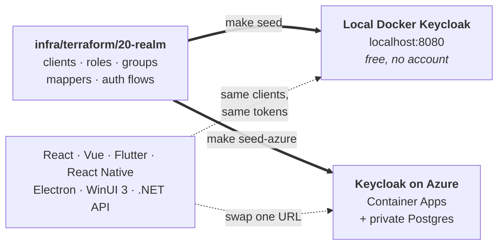
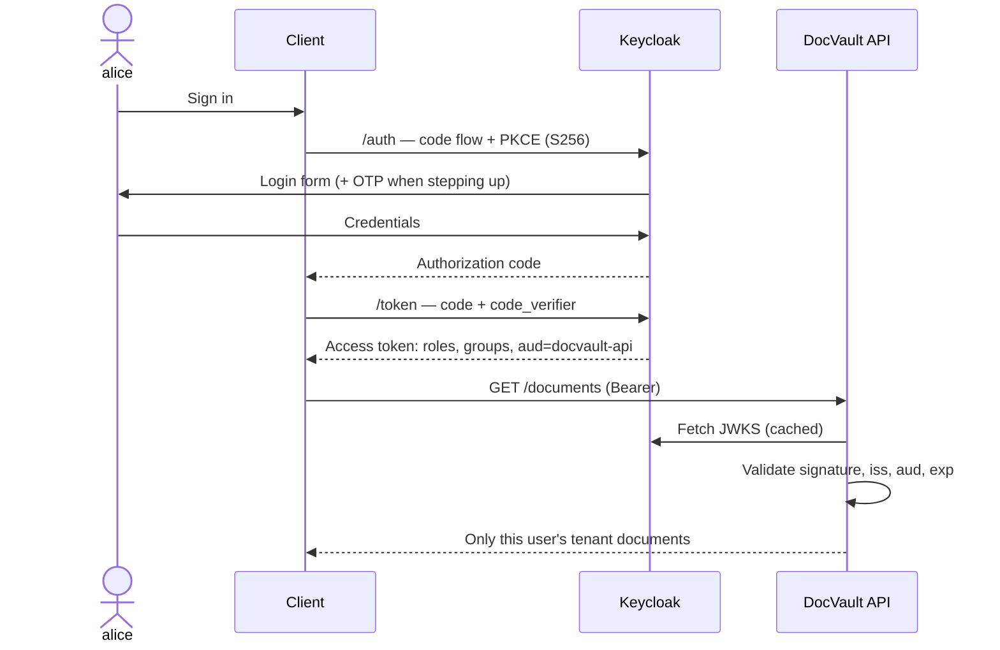
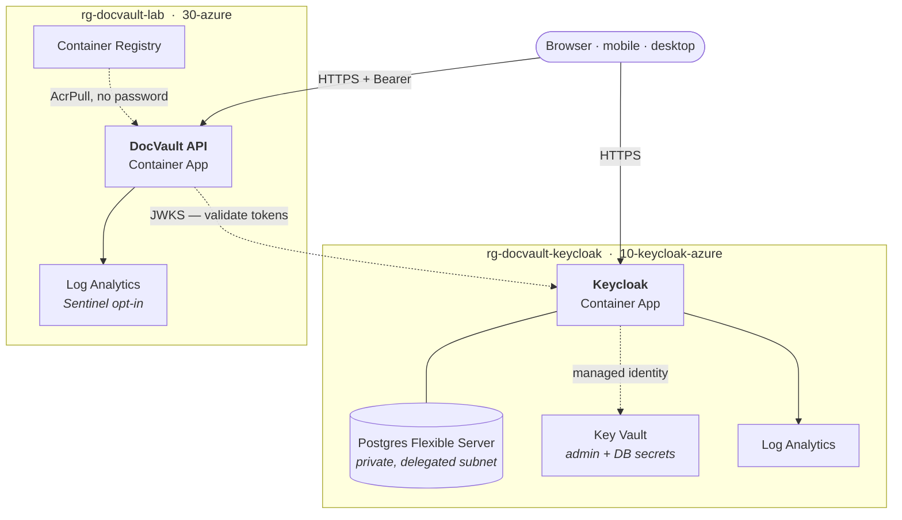

# DocVault — a Keycloak identity lab

A runnable proof of concept for [Keycloak](https://www.keycloak.org/), the
open-source identity and access management server. It covers running Keycloak,
configuring a realm as code, deploying to Azure, and integrating it with web,
mobile, desktop and backend clients.

**The whole lab runs locally, for free.** The realm is defined once in Terraform
and applied unchanged to either a local Docker Keycloak or an Azure deployment —
so the free local lab is a faithful rehearsal for the cloud one, not a
simplified toy.




## Prerequisites

For the local lab — everything in the Quickstart below:

| Tool | Version | Why |
|---|---|---|
| **Docker** | with Compose v2 | runs Keycloak, Postgres and Mailpit |
| **Terraform** | **≥ 1.9** | applies the realm — `make seed` *is* Terraform, not a script |
| **.NET SDK** | **10.0** | the API, the worker and the test suite |
| **Node** | **20.19+ or 22.12+** | the React and Vue clients (Vite 8 requires it) |

**macOS**

```bash
brew install --cask docker
brew tap hashicorp/tap && brew install hashicorp/tap/terraform
brew install --cask dotnet-sdk
brew install node
```

**Windows**

```powershell
winget install Docker.DockerDesktop
winget install Hashicorp.Terraform
winget install Microsoft.DotNet.SDK.10
winget install OpenJS.NodeJS
```

Terraform is the one people miss: it is not bundled, and `make seed` fails
without it. Check with `terraform version`.

> On macOS the `brew tap` step is required — `terraform` is no longer in
> homebrew-core (it moved to HashiCorp's own tap after the licence change), so
> plain `brew install terraform` fails with *"No available formula"*. Other
> platforms: [terraform.io/install](https://developer.hashicorp.com/terraform/install).

> `make` is preinstalled on macOS but not on Windows. Use
> `winget install GnuWin32.Make`, run the lab from WSL, or read the Makefile and
> run the underlying commands directly — they are all one-liners.

Only for the parts you actually try:

| Doing what | Also needs | macOS | Windows |
|---|---|---|---|
| Deploying to Azure | Azure CLI, logged in | `brew install azure-cli` | `winget install Microsoft.AzureCLI` |
| The e2e tests | Playwright browsers | `npx playwright install chromium` | same |
| The Flutter client | Flutter (Dart SDK ≥ 3.13) | `brew install --cask flutter` | [docs.flutter.dev/install](https://docs.flutter.dev/install) — not in winget |
| The WinUI 3 client | **Windows only** | not possible — XAML does not compile off Windows | .NET 10 SDK; see the note below |

> **WinUI 3 build requirements.** CI builds it on `windows-latest`, which ships
> Visual Studio Enterprise 2022 — so a build with *only* the .NET SDK is
> untested. If `dotnet build` alone fails, install Visual Studio 2022 with the
> **Windows application development** workload, which is the documented path.

Nothing here needs a paid account. Docker, .NET, Node and Terraform are enough
for the entire lab, including the full test suite.

## Quickstart

```bash
make up      # Keycloak + Postgres + Mailpit  (~30s)
make seed    # apply the DocVault realm via Terraform
make api     # .NET 10 API on :5001
make web     # React SPA on :5173   (in another shell)
```

`make web` creates `apps/web-react/.env` from its `.example` on first run — the SPA
reads `VITE_*` variables and throws at import time without them, which shows up as a
blank page rather than an error.

The root `.env.example` is a separate thing, for the shell tools (`make token`,
`tools/*.sh`) rather than the apps. Copy it if you use them: `cp .env.example .env`.

Sign in as **alice** / `DocVaultLab!2026`. `make help` lists everything.

The Keycloak admin console is at <http://localhost:8080/admin> (`admin`/`admin`) —
note it opens on the `master` realm, so switch to **`docvault`** to see the demo
users and clients.

## How a sign-in actually flows

Every client here does the same thing — authorization code + PKCE through a real
browser, then a bearer token the API validates itself. No client ever sees a
password, and the API never calls Keycloak to check a request.



The two steps that fail *silently* when misconfigured are both visible here: the
audience mapper (`aud=docvault-api`) and the roles/groups claims. Without them
sign-in still succeeds and every API call returns 401 or 403.

## Deploying to Azure

The whole lab also runs on Azure: Keycloak on Container Apps with a private
Postgres, configured by the same Terraform that configures your local container.




Azure adds a third, platform-managed resource group (`ME_...`) for the VNet-integrated
Container Apps environment's load balancer. That is expected, not drift.

**→ [Step-by-step deployment guide](docs/09-deploying-on-azure.md)** — six steps,
each with a verification command, plus costs and teardown.

You can stop after step 3 and have cloud Keycloak driving your local apps for
about $40/month; `make azure-destroy` removes everything. Pick your region with
`export TF_VAR_location=<region>` before the first apply — it defaults to
`swedencentral`.

## Running from VS Code

`.vscode/launch.json` has an F5 target for every runnable app — Flutter (iOS
simulator / Android emulator / Azure), the API (local or Azure), Electron, the
worker, and the React SPA. Tasks cover `lab: up + seed` and the Vite dev server.

The Android target also runs `make android-reverse` first, which points the
emulator's own `localhost` at your machine. That is not a convenience: Keycloak
derives the token issuer from the request host, so reaching it as `10.0.2.2`
mints tokens the API rejects. Running Flutter from the command line? Run
`make android-reverse` yourself after starting the emulator.

The Azure variants read files you create and that are gitignored
(`config/azure.json`, `appsettings.Azure.json`, `apps/desktop-electron/config.json`,
`apps/web-react/.env`), so no deployment URL is committed. Copy the matching
`.example` to get started.

## What it demonstrates

| # | Scenario | Where |
|---|---|---|
| 1 | RBAC + per-document ownership via Keycloak Authorization Services | [uc1](docs/use-cases/uc1-rbac-document-sharing.md) |
| 2 | Enterprise SSO — Entra ID federated as an external OIDC IdP | [uc2](docs/use-cases/uc2-enterprise-sso-entra.md) |
| 3 | Step-up MFA — `acr_values`, RFC 9470 challenge, conditional OTP | [uc3](docs/use-cases/uc3-step-up-mfa.md) |
| 4 | Machine-to-machine — `client_credentials`, service accounts | [uc4](docs/use-cases/uc4-service-to-service.md) |
| 5 | Consent + data minimisation — pairwise subject identifiers | [uc5](docs/use-cases/uc5-consent-and-privacy.md) |
| 6 | Audit → SIEM → Azure Sentinel | [uc6](docs/use-cases/uc6-audit-siem-sentinel.md) |

## Repository map

```
docs/                     the guide - start at 00-what-keycloak-is.md
infra/
  terraform/10-keycloak-azure/  Keycloak on Azure       (azurerm)
  terraform/20-realm/           realm config            (keycloak/keycloak)  <- source of truth
  terraform/30-azure/           your apps on Azure      (azurerm)
  local/                        docker-compose lab
apps/
  api-dotnet/             .NET 10 resource server + worker + tests
  web-react/              full reference client (PKCE, RBAC, step-up, TokenInspector)
  web-vue/                runnable-lite
  mobile-flutter/         runnable-lite  (flutter_appauth + Keychain/Keystore)
  mobile-react-native/    auth module    (react-native-app-auth)
  desktop-electron/       runnable-lite  (loopback PKCE, tokens never in the renderer)
  desktop-winui/          WinUI 3 / .NET 10 (Duende OidcClient, DPAPI) + cross-platform auth lib
tests/e2e-playwright/     browser login -> API call
tools/                    export-realm.sh, decode-token.sh
```

## The idea worth stealing

The realm lives in Terraform, not in the admin console. One module targets any
Keycloak:

```bash
make seed         # local Docker Keycloak
make seed-azure   # Keycloak on Azure
```

Same 74 resources, same realm; only a URL and a credential differ. Two
consequences worth having:

- **The local lab is faithful.** If it stops being so, `make seed` fails
  immediately instead of during a migration.
- **Console drift is a test failure.** `make plan` should be empty; when someone
  changes something by hand, CI says so.

CI applies the module to a real Keycloak on every run, so the claim is checked
rather than asserted.

## Verified

Built and checked against real software, not just written down:

- 74 Terraform resources applied to Keycloak 26.6.3, with a clean re-plan;
  `acr_values_supported`, the audience mapper and service-account roles confirmed
  in a real token.
- .NET 10 API: 27 tests pass, including forged `alg:none`, wrong-key,
  wrong-audience, wrong-realm and expired tokens, and 403-vs-401 for an
  authenticated-but-unauthorized caller.
- Desktop auth library: 45 tests pass on macOS/Linux. **Both desktop clients have
  been run end-to-end against the Azure deployment** — WinUI 3 on Windows and
  Electron on macOS — with system-browser sign-in, correct issuer, audience and
  roles in the token, and tenant-scoped documents returned. The WinUI shell is
  also compiled by the `windows-latest` CI job.
- Keycloak on Azure and the API on Container Apps are both applied and running,
  not merely planned.
- 7 Playwright tests pass in a real browser against real Keycloak.
- React and Vue build; Flutter analyzes clean and its tests pass.
- The Flutter client has been driven end-to-end on an Android emulator against the
  local lab, and React against the full Azure stack (cloud Keycloak *and* cloud API).

## Licence

MIT — see [LICENSE](LICENSE).
